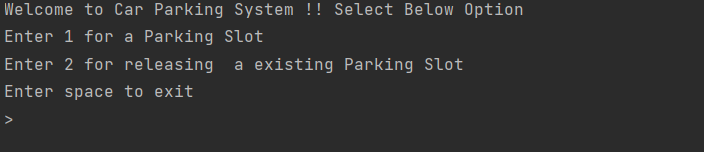

# car-parking-system

A command line based car parking system implementation 

### How to run the application

Run the Application.java class from commandLine or any Java IDE.

### Assumptions
1. Parking slot will be used and released on same day.
